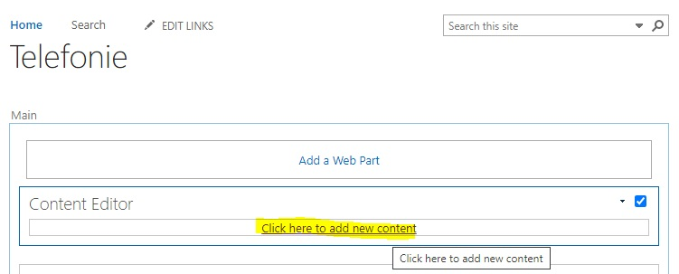

# Calendar Snippets
When u create a Calendar View for a List, then u have a Calendar Like View.

This View has not the same functionality as a Calender App in SharePoint.

In the Ribbon some buttons are grayed out, and on hover a calendar cell the "Add" Hyperlink is not shown.

Now we add custom script code to the Calendar View of the List to show our own "Add New Item" Hyperlink.

## Edit the Page with the Calendar View

## Add a new Content Editor Web Part to the Page

## Edit the Content Editor Web Part
When you uploaded the snippet file to Site Assets then put the URL to that file in the Content Link Property

The other option is to put the content directly into the Content Editor.

Then the Ribbon is visible and u can click the Edit Source Button.

Put the content of the ``CalendarAddNewFormLinkSnippet.html`` to the HTML Source and press OK.

Stop Editing the Page when done.

# Check the Hover

> When you have used the ``CalendarAddNewFormLinkSnippet.html``

Hover over a cell and click the Hyperlink.

The New Item Dialog should be open and the Date and Time should be set correctly (see [Field Values From URL](jslink.md))

# Check the Open Edit Dialog

> When you have used the ``CalendarOpenEditDialogSnippet.html``

That Snippet will Open the Edit Form Page as Dialog when u click an Event Item Link or when u double click the Event Item.

When the Event saved the Calendar View Items will be reloaded without to reload the whole Page.

## Conclusion

The Snippets are designed and tested to use in a Calendar View of a List and also to use in the View of a Calendar App (and it can have also Calendars Overlay). 

> Note that the Calendar App has it's own "Add" Hyperlink

When we have a Calendar View, then not all Actions are provided by default. Currently i have no snippets to provide alternative actions or to connect to the Ribbon.

## Remarks

An Calendar Event has a Start and End Time. When u dont want a End Time, then create a List with one Field for the Date and Time. Create a Calendar View for that List and select that Field for Begin and End.

> My ``Telefonie`` List in the Screenshots is for Telephone Hotline Call Routing outside the Business Time.

