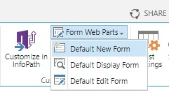

# JSLink_FieldValuesFromUrl
When u have a List, then there are three Default Form Web Parts:

- Default New Form
- Default Display Form
- Default Edit Form

The Pages are
- NewForm.aspx
- DispForm.aspx
- EditForm.aspx

So u can open the new form with

``http://sp2019/Lists/<YourListName>/NewForm.aspx``

or to display an list item by

`http://sp2019/Lists/<YourListName>/DispForm.aspx?ID=<ItemID>`

Ok great, but u cannot set the values in the form by passing they with the URL query string.

So the follow URL will not set the field ``MyDate`` to the value, when the Dialog opens.
``http://sp2019/Lists/<YourList>/NewForm.aspx?MyDate=20.11.20222``

You can add a script to the Form Web Part, which set the value, ok will works.

You can also use JSLink, the Microsoft Sharepoint Stuff.

We use the ``TemplateManager`` in the JSLink Script, to override some Fields in the NewForm for example.

See ``JSLink_FieldValuesFromUrl.js``

My Custom Field is ``Von`` (from), and it is a Date and Time field in my list.

```javascript
var overrides = {
    Templates: {
        Fields: {
            // Custom "Von" Field is Date and Time
            Von: {
                NewForm: function(ctx) {
                    // Take Value from URL and Render Field Input Form
                    ctx.CurrentFieldValue = GetUrlKeyValue('Von');
                    return SPFieldDateTime_Edit(ctx);
                }
            }
        }
    }
};
```

> Notice that we have to render a date and time input field by ``SPFieldDateTime_Edit``. There are several different render functions for different field types.

Ok so far, `GetUrlKeyValue` is also a build in function of the Sharepoint Client Script Library.

Now we have to modify the New Form Web Part.

## Upload JSLink Script to Site Assets and Copy the Link


## Open Default New Form of the List (Ribbon)


## Edit Page


## Edit Web Part


## Paste the Link in the "JS Link" field, Save and Stop Editing


Thats all, now we can open the New Item Form and pass the Field Value in the URL.

`http://sp2019/Lists/Telefonie/NewForm.aspx?`**Von=20.11.20222**

and we can also use Date and Time

`http://sp2019/Lists/Telefonie/NewForm.aspx?`**Von=20.11.20222 10:15**


> The JSLink Script will works only for the ``Von`` Field.

## Modify the JSLink Script with Your Custom Field

When you create a column in a list, then u must set a column name.
The first time, that name are used and stored in the internal database.

> When you change a column name in a list, then the internal name from the first time is not changed.

That is to prevent conflicts and to ensure data integrity.

> A column name you did see is a display name, but u have to use in workflows or in scripts the internal name.

You can use Powershell to query the Sharepoint List and to take the correct name to use.

But there is a simple trick. Open the list settings and click on the column you want.


In my case i have created a column with the name ``Von``, but later i renamed that column to ``Beginn``.

Now have a look at the URL, you can see the original column name we need to use.


## Date and Time Regional Settings

In my example i used the german date format ``20.11.2011``.

It based on the Regional Settings of the Site.

Maybe you have to use other date formats in your Sharepoint.

So it can be ``MM/dd/yyyyy``

``NewForm.aspx?MyDate=11/20/20222``

The Form Dialog validates the input fields and is checking the format on save.


> Check the format to use before u begin to deploy something.


